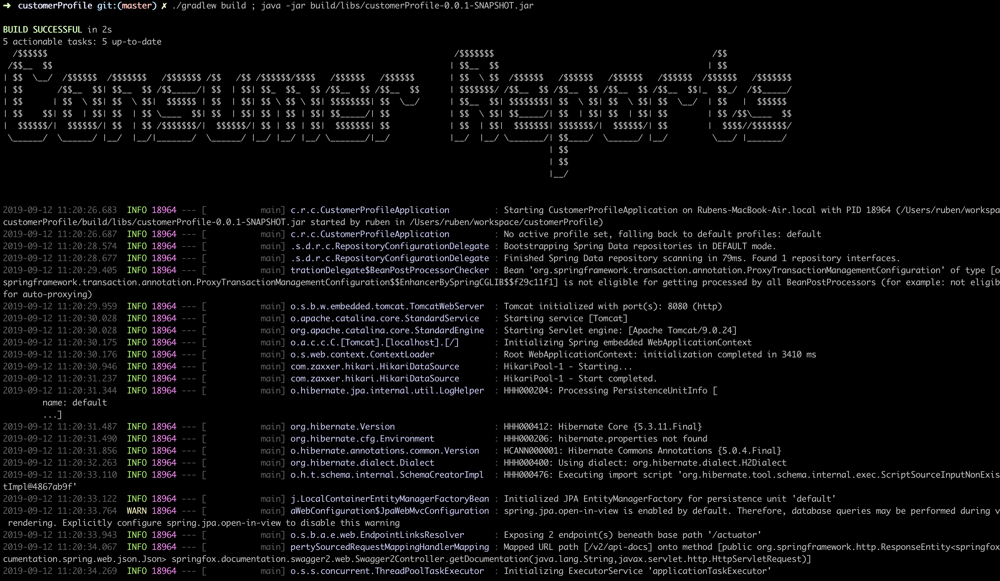
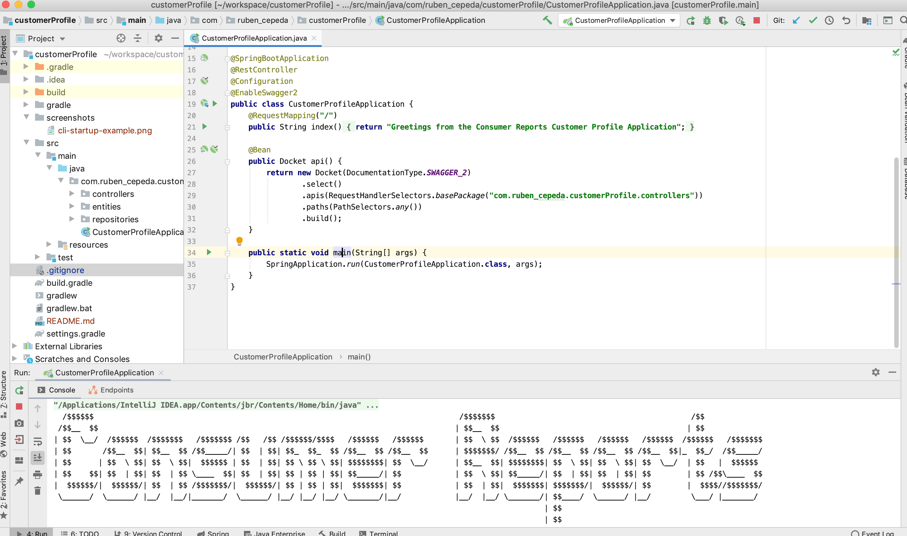

# Customer Profile Service
Customer Profile Service is a Springboot Java service for dealing with customer's first name, last name and email 
address.

# Table Of Content
* [Users Guide](#users-guide)
* [Design Overview](#design-overview)

## Users Guide
### Running Application
The following illustrate how to build and run the customer profile service.

#### Command Line
Please note all paths are relative to this README file.
```bash
./gradlew build ; java -jar ./build/libs/customerProfile-0.0.1-SNAPSHOT.jar
```

**Example:** 




## IntelliJ IDEA IDE

* Navigate over to the Spring Boot Main Application Class (com.ruben_cepeda.customerProfile.CustomerProfileApplication)
* Create a Run Configuration by running the main method (see example screenshot below)

**Example:** 



## Verify Service Running
The health endpoint will let you know hte service is ready for live traffic
```bash
curl -s http://localhost:8080/actuator/health

{
  "status": "UP"
}
```

### Application API Documentation
This application publishes a Swagger/OpenApi spec for automatic generation of client code as well as a 
swagger/openApi UI for quick testing.  Please note that the Swagger/OpenApi endpoints are part of the service it
must be up so the endpoints can be usable.

* [Swagger/OpenApi Spec](http://localhost:8080/v2/api-docs) - see [swagger/openApi codegen](https://swagger.io/tools/swagger-codegen/)
* [Swagger/OpenApi UI](http://localhost:8080/swagger-ui.html)


## Design Overview 
### Functional
Endpoints to performed CRUD operations.
* [Create Customer](#endpoint-create-customer)
* [Read a Customer](#endpoint-read-a-customer)
* [Read All Customer](#endpoint-read-all-customers)
* [Update Customer](#endpoint-update-customer)
* [Delete Customer](#endpoint-delete-customer)

#### Endpoint: Create Customer
| | |
| ------------- | ------------- |
|URI:| `/customers`        |
|METHOD:| `POST` |
|PARAMS:||
|BODY: |`{"firstName":"Ruben","lastName":"Cepeda","email":"ruben.cepeda@gmail.com"}` |
|RESPONSE:|`{"id":1,"firstName":"Ruben","lastName":"Cepeda","email":"ruben.cepeda@gmail.com"}`|

#### Endpoint: Read A Customer
| | |
| ------------- | ------------- |
|URI:| `/customers/{id}`        |
|METHOD:| `GET` | 
|PARAMS:||
|BODY: ||
|RESPONSE:|`{"id":1,"firstName":"Ruben","lastName":"Cepeda","email":"ruben.cepeda@gmail.com"}`|

#### Endpoint: Read all Customers
| | |
| ------------- | ------------- |
|URI:| `/customers`        |
|METHOD:| `GET` | 
|PARAMS:|`?page=0&size=2&sortBy=lastName`|
|BODY: ||
|RESPONSE:|`{"id":1,"firstName":"Ruben","lastName":"Cepeda","email":"ruben.cepeda@gmail.com"}`|

#### Endpoint: Update Customer
| | |
| ------------- | ------------- |
|URI:| `/customers/{id}`        |
|METHOD:| `PUT` | 
|PARAMS:||
|BODY: |`{"firstName":"Ruben","lastName":"Garcia","email":"ruben.cepeda@gmail.com"}`|
|RESPONSE:|`{"id":1,"firstName":"Ruben","lastName":"Garcia","email":"ruben.cepeda@gmail.com"}`|

#### Endpoint: Delete Customer
| | |
| ------------- | ------------- |
|URI:| `/customers/{id}`        |
|METHOD:| `DELETE` |
|PARAMS:||
|BODY: ||
|RESPONSE:|`{"id":1,"firstName":"Ruben","lastName":"Cepeda","email":"ruben.cepeda@gmail.com"}`|


### Database
#### Table: Customers

| Name:         | Type:         |Note:|
| ------------- | ------------- |------------|
| `ID`          | NUMBER        |NOT NULL, Primary key, Auto Increment|
| `FIRST_NAME`  | VARCHAR(128)  |NOT NULL|
| `LAST_NAME`   | VARCHAR(128)  |NOT NULL|
| `EMAIL`       | VARCHAR(256)  |NOT NULL, unique constraint |

### Networking
There will be a lot balancer in front of the service

### Security
There will be an API Gateway in front of the service to provide authentication and authorization for each of the API
endpoints. 


